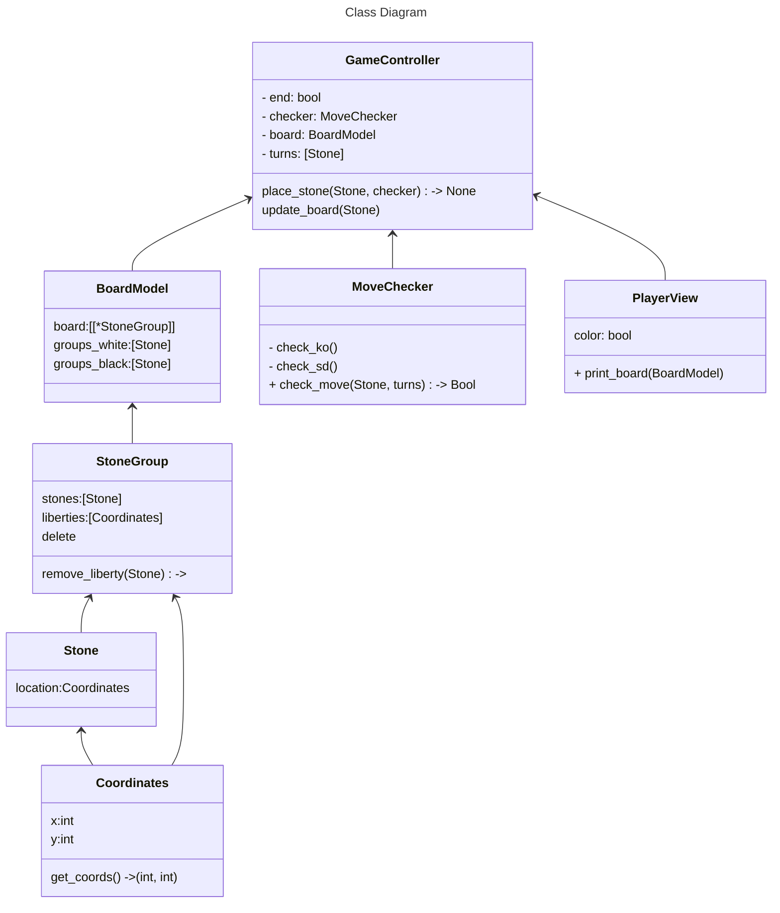

# py-go
Implementation of the go board game in Python.

- TODO check which group liberty was played
- Game End: (1) if player resigns (2) two passes in a row (3) no intersections left

## Flow:
- GameController.place_stone(Coordinates)
- if MoveChecker.check_move():
    - check stone group and create one if none
    - calculate liberties and delete groups if 0
    - update board
    - update view