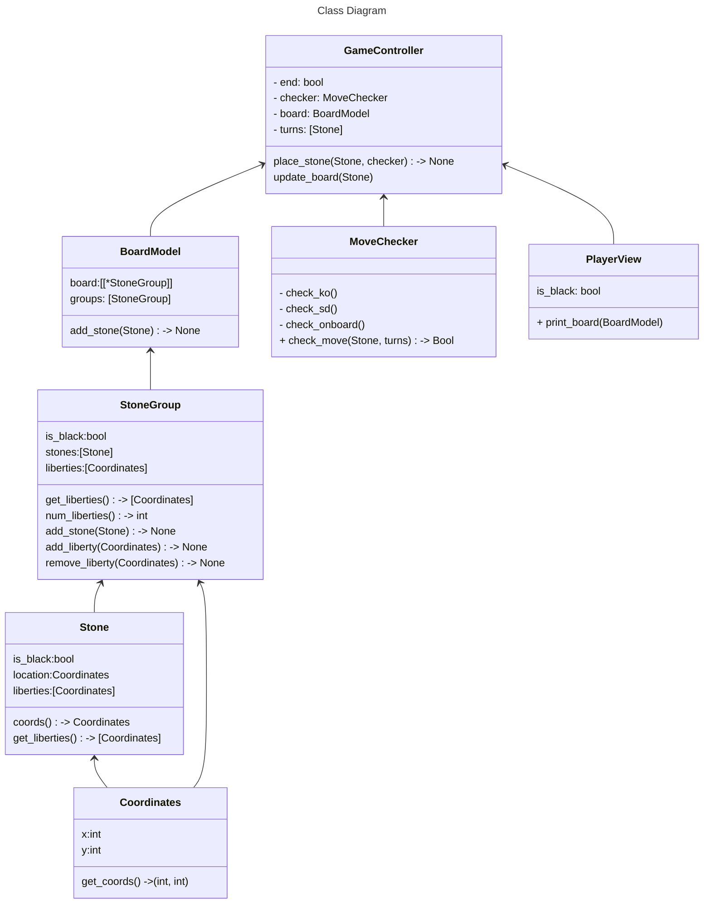

# PyGo
Implementation of the go board game in Python.

```mermaid
---
title: Class Diagram
---
classDiagram

    GameController <-- BoardModel
    BoardModel <-- StoneGroup
    StoneGroup <-- Stone
    GameController <-- MoveChecker
    GameController <-- PlayerView
    Stone <-- Coordinates
    StoneGroup <-- Coordinates

    class BoardModel {
        board:[[*StoneGroup]]
        groups: [StoneGroup]
        add_stone(Stone) -> None
    }

    class GameController {
        - end: bool
        - checker: MoveChecker
        - board: BoardModel
        - turns: [Stone]

        place_stone(Stone, checker) -> None
        update_board(Stone)
    }

    class MoveChecker{
        - check_ko()
        - check_sd()
        - check_onboard()
        + check_move(Stone, turns) -> Bool
    }

    class PlayerView {
        is_black: bool

        + print_board(BoardModel)
    }

    class Coordinates {
        x:int
        y:int
        get_coords() -> (int, int)
    }

    class Stone {
        is_black:bool
        location:Coordinates
        liberties:[Coordinates]

        coords() -> Coordinates
        get_liberties() -> [Coordinates]
    }

    class StoneGroup {
        is_black:bool
        stones:[Stone]
        liberties:[Coordinates]

        get_liberties() -> [Coordinates]
        num_liberties() -> int
        add_stone(Stone) -> None
        add_liberty(Coordinates) -> None
        remove_liberty(Coordinates) -> None
    }
```

- TODO check which group liberty was played
- Game End: (1) if player resigns (2) two passes in a row (3) no intersections left