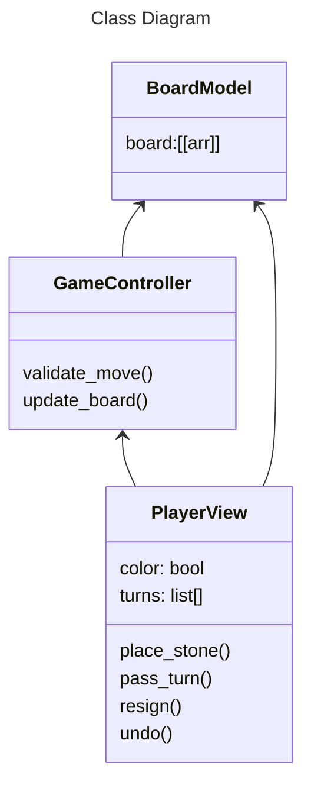

# py-go
Implementation of the go board game in Python.

```mermaid
---
title: Class Diagram
---
classDiagram
    GameController <-- PlayerView
    BoardModel <-- GameController
    BoardModel <-- PlayerView

    class BoardModel {
        board:[[arr]]
    }

    class GameController {
        validate_move()
        
        update_board()
    }

    class PlayerView {
        color: bool
        turns: list[<int,int>]
        place_stone()
        pass_turn()
        resign()
        undo()
    }
```